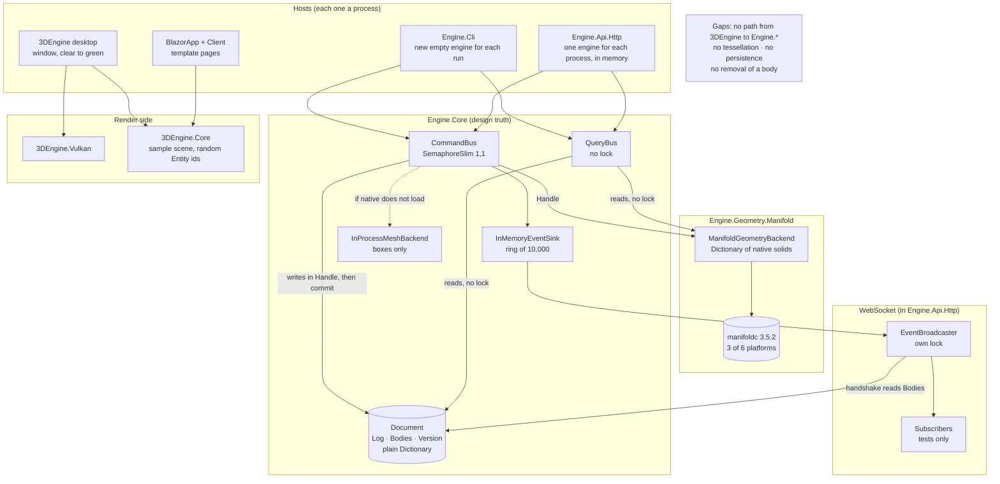
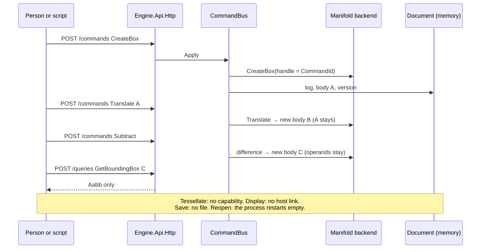
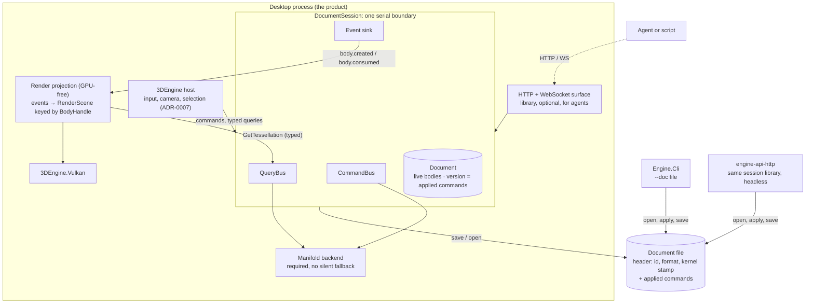
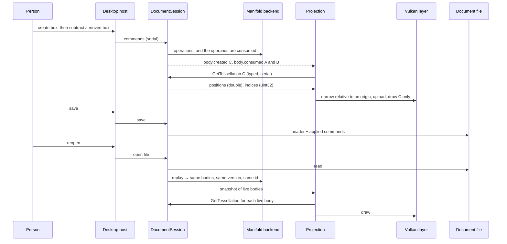

# Architecture challenge of 2026-09-23 — Is this the right foundation for the CAD application?

> **About this file.** The session of 2026-09-23 published this challenge as a web page. This file
> holds the same text in Markdown. The form changed, and the words did not. The section "Decisions
> of the owner, 2026-09-25" at the end is new. The codebase review gate reads only files with the
> name `YYYY-MM-DD-codebase-review.md`, therefore it does not read this file.

This page uses Simplified Technical English (ASD-STE100). It tests each decision against the product requirements, the code that runs, and the next planned tasks. An ADR or a boundary is not accepted here because it is documented. A simplification is not accepted because it is smaller.

- **Code:** `main` at `01a42a1`. The branch `review-2026-09-23` changes documents and tests only.
- **Changed by this pass:** no code and no ADR
- **Starting point:** the codebase review of 2026-09-23, checked again

The labels:

- **[Observed]** read in the code, or seen in a run
- **[Inferred]** a conclusion that no run shows
- **[Recommended]** a proposal; you decide

## Verdict

**The core idea is right for parametric CAD.** The core idea is a log of commands that rebuilds design truth, with geometry as a cache and deterministic identity from the command. Onshape and FreeCAD also keep a history of operations and regenerate the geometry, because a mesh cannot be edited parametrically. Keep this core.

**Four parts under that core are not right yet.** Each one causes a failure in code that exists, or in the next phases:

1. **There is no consistency boundary.** Three readers use three different locks. A run produced exceptions and one wrong answer. **[Observed]**
2. **The log cannot rebuild the document.** The version counts rejected commands, and the log does not hold them. ADR-0015 promises the same version after a restart, and it also refuses to store rejected commands. **[Observed]**
3. **The unit that a person edits has no identity.** Each operation creates a new body, and nothing removes the old one. Roadmap R6 then gives the host a "view filter", which makes the client decide what the model is. **[Observed]**
4. **The topology and the persistence scope do not fit a desktop CAD application.** The documents send the desktop host through HTTP to a separate server. That server saves one log file for each process, with no open and no save by a person. **[Observed]** in the ADRs.

**Two parts have no credible path into the product in their present form:** the Blazor pair, and `3DEngine.Core`.

## New evidence from this pass

Three probes ran against `Engine.Core` in a scratch program outside the repository. **[Observed]**

| Probe | What it did | Result |
|---|---|---|
| A · parallel reads | 20,000 `CreateBox` commands on one task. Four tasks ran `GetBoundingBox` and copied `Document.Bodies`, as the WebSocket handshake does. | 6,532 × `ArgumentException`, 20 × `InvalidOperationException` ("Collection was modified"), 1 × `IndexOutOfRangeException`. One query reported an existing body as absent (`KeyNotFoundException` from the backend). |
| B · replay, no expected version | A rejected `CreateBox`, then an applied one. Replay of the log. | The bodies are equal (1 and 1). The version differs: 3, then 2. The document identifier differs. |
| B′ · replay, with expected version | The same, and the second command states the version that it saw (from the first review). | The replay rejects it: 0 bodies. |
| C · `Query<object>` | The bus with `T = object`, serialized with the options of `ApiJson`. | The JSON has the real fields: `minX…maxZ` for `Aabb`, and the arrays for a mesh record. |

## Architecture as implemented today

This diagram shows only connections that exist in the code. A missing link is written in the "Gaps" box, not drawn as an edge.

*Architecture as implemented at `01a42a1`. **[Observed]***

### The workflow today: create or edit → render → save → reopen

| Step | Status | Evidence |
|---|---|---|
| Create a body | Only through HTTP, or one command on the CLI | HTTP trace: `CreateBox status=Applied seq=1`. The desktop host has no path to the engine. |
| Edit a body | It makes a new body | `Translate` and `Subtract` each add a body with the handle of the command (`TranslateCommandHandler.cs:70,95`). After the first demonstration the Document holds 4 bodies. |
| Tessellate | Absent | No capability and no query. Both hosts fix the result type to `Aabb` (`Cli.cs:157`, `QueriesEndpoint.cs:81`). |
| Display | Absent | `3DEngine.csproj` references no `Engine.*` project. `NativeThreeDEngine.Render` clears to green. |
| Save | Absent | `Document.Log` is a list in memory (`Document.cs:16-17`). No codec exists. ADR-0015 is `Proposed`. |
| Reopen | In memory only, and not exact | `Replay.ReplayLog` rebuilds the bodies, but not the version or the document identifier (probe B). A command with an expected version after a rejection is lost (probe B′). |

*What runs today, end to end. The note names where the route stops. **[Observed]***

## Recommended target architecture

**[Recommended]** **Nothing in this diagram exists yet**, except the parts that the first diagram also shows. It assumes the "hybrid" topology of concern 5. Question 1 at the end asks you to choose it.

*Target architecture. The dotted edge means "over the network". Blazor is gone. The managed backend is a test double only. **[Recommended]***

### The workflow in the target

*The same route in the target. Each arrow is a proposal. **[Recommended]***

## 1 Who owns design state, geometry, render state and identity

#### Current design

- **Design state:** the `Document` holds `Log`, `Bodies` and `Version` (`Engine.Contracts/Document.cs:11-23`). Only the commit step of the bus changes it (`CommandBus.cs:98-138`). **[Observed]**
- **Geometry:** the backend owns it, and ADR-0012 §2 calls it a cache that a replay rebuilds. The backend changes during `Handle`, before the commit (`SubtractCommandHandler.cs:76-79`). **[Observed]**
- **Identity:** `BodyHandle(Guid)` is the `CommandId` of the command that made the body. Each operation makes a new body, and no code removes or consumes a body. A grep for a removal path finds nothing. **[Observed]**
- **Render state:** `3DEngine.Core` has `Entity.Id = Guid.NewGuid()` and a string `MeshId` (`Models/Entity.cs`). No field refers to a `BodyHandle`. The host loads a fixed sample scene and draws nothing from it. **[Observed]**
- **The change flow:** none exists. ADR-0009 §4 puts the projection in the host, and ADR-0009 §2 forbids a reference in either direction between the two kernels. **[Observed]**

#### Requirement and fulfilment

Objectives 11 (editable parametric CAD) and 17 (the log stays), anti-objective 1 (no second source of truth), and ADR-0007 (camera and selection belong to the client).

- **Fulfilled:** the separation holds. No render type is in the Document.
- **Not fulfilled:** an edit makes a second body, and both stay. R6 plans "a view filter for the latest result" in the host (`roadmap.md:84`). That filter decides which bodies are the model, which is a decision about design truth made in a client.

#### Cost of keeping it

- Each host must rebuild "the current model" from the history of bodies, and two hosts can disagree.
- A saved file keeps each dead body, and each reopen tessellates them.
- The render kernel needs a table that maps its random identities to bodies.
- The ban on the render-to-contracts direction forces the projection into the GPU host program, where a runner with no GPU cannot test it.

#### Options

| Option | Complexity | Performance | Testing | Future features |
|---|---|---|---|---|
| A · Keep: immutable bodies, and a view filter in the host | None now; logic grows in each host | Dead bodies are tessellated | Filter logic is in the GPU host | Undo, selection and features each need their own filter |
| B · A live set in design truth. An operation names the bodies it consumes, the bus removes them from the live set and emits `body.consumed`. Render state is keyed by `BodyHandle.Id`. A GPU-free projection may read `Engine.Contracts`. The direction from design to render stays forbidden. | Small: one list on the handler result, one event kind, one ADR change | Only live bodies are drawn | The projection is testable on each runner | A step toward the part and feature model of K0 |
| C · A full part and feature model now (P8d, K0) | 12 to 20 evenings for K0 alone | The best end state | A large new surface | The right end state, but it blocks track R |

#### Recommendation

**[Recommended]** Option B, before R5. It changes `Engine.Contracts`, so it needs an ADR and your acceptance. It also changes ADR-0009 §2 in one direction only: render may read the contracts, and design truth may never read render state. That ban on the design direction is the rule that protects anti-objective 1. The ban on the render direction protects nothing that I can find.

**Evidence that would change it:** if you want each intermediate solid to stay visible as a history, choose A with an explicit history mode. If K0 comes before R5, go to C directly.

## 2 The log, replay, CQRS, events and the WebSocket

#### Current design

- **The log** is a list of command objects in memory (`Document.cs:16-17`). The commit appends to it (`CommandBus.cs:102`). **Replay** runs each command through the handlers against a new backend (`Replay.cs:22-29`).
- **The version** counts every event, rejected and cancelled ones included (`Document.cs:11-14`, `CommandBus.cs:159-174`). Each Document gets a new identifier (`Document.cs:27`, `EngineHosting.cs:35`).
- **Events** go to a ring of 10,000 and to the WebSocket broadcaster with reset and resume (`EventBroadcaster.cs:44-72`). Only tests subscribe today.
- **CQRS:** queries are not logged (`QueryBus.cs:8`).
- **ADR-0015** promises "same `Document.Version`" after a restart (§4.5). Its non-goals refuse "Persisting Rejected commands". **[Observed]**

#### Requirement and fulfilment

| Part | Concrete need | Fulfilled today? |
|---|---|---|
| Command log | Save and reopen (objective 11), undo (P8c), regeneration after a parameter edit (objective 11), agents (charter) | Partly. The log holds the right entries, but it has no codec and no file, and a replay does not reproduce the version. |
| Replay | Reopen, determinism (objective 17, anti-objective 16) | The bodies are rebuilt. The version and the identifier are not. Probe B′ loses a body. |
| CQRS | Tessellation and inspection must never enter the log (anti-objectives 3 and 5) | Yes |
| Events | Each host that draws must learn about each change (R5), in any topology | The events exist. No change consumes a body, so there is no `body.consumed`. |
| WebSocket | Observers in another process: agents, a remote UI | It works, and tests use it. No product client uses it. |

#### Cost of keeping it

If persistence is built on today's meaning of the version, a reopened document has a different version and a different identifier. An optimistic check (`ExpectedDocumentVersion`) that passed before the save fails after the reopen, and a client cannot resume. ADR-0015 would ship with a promise that its own non-goal breaks.

#### Options for the version

| Option | Complexity | Replay | Risk |
|---|---|---|---|
| A · The version counts applied commands only. The event stream keeps its own sequence number for the cursor. A rejection changes the stream and not the version. | Low: two counters instead of one | Exact: the log reproduces the version | A resume after a restart gives a reset, which is honest |
| B · The log also stores rejected and cancelled commands, and a replay runs them again | Medium | Exact only if each rejection repeats. A native failure or a cancellation may not repeat. | A fragile replay |
| C · Keep, and forbid `ExpectedDocumentVersion` after persistence | None | The bodies only | It removes optimistic concurrency, which multiple clients need |

**The need for the WebSocket.** Keep it and do not extend it until the topology decision. It works, it is tested, and it is the surface for agents. A removal saves little.

#### Recommendation

**[Recommended]** Option A, in an ADR that also rewrites the promise of ADR-0015 §4.5. Store the document identifier in the file header, as ADR-0015 §3 already plans. Store a kernel stamp too, for example "manifold 3.5.2, double". A replay with a different kernel can give different geometry, and the reader must know that.

**Evidence that would change it:** a requirement for an audit trail of rejected commands. Then store them as audit records that no replay runs, and that do not count in the version.

## 3 Query results beyond `Aabb`

#### Current design

The bus is generic. `QueryBus.Query<T>` casts the `object` result of the handler to `T` (`QueryBus.cs:43-65`). Both hosts ask for `Aabb` (`Cli.cs:157`, `QueriesEndpoint.cs:81`). Their comments cite ADR-0016 "Next", and that section does not name this limit. Probe C shows that `Query<object>` writes the real fields of any result. **[Observed]**

#### Requirement and fulfilment

R2 needs `GetTessellation`. The charter says that the surface describes itself, and agents need each query. The bus fulfils this, and the two hosts do not.

#### Cost of keeping it

Each new result type adds a branch to two hosts. That is the special-case growth that ADR-0016 removed for commands. R2 fails at the cast, and the host then reports `E-QRY-UNKNOWN`, a code with a different meaning.

#### Options

| Option | Complexity | Performance | Future |
|---|---|---|---|
| A · `Query<object>` in both hosts. In-process callers keep `Query<Tessellation>`. | One line in each host | JSON for remote clients; no JSON in process | Each later query works with no host change |
| B · Each handler declares its result type, and the hosts use it | More code | The same | Only a typed remote client benefits |
| C · A separate endpoint for each heavy result, such as a binary mesh endpoint | One special case for each type | The best for large meshes | The case growth that A avoids |

#### Recommendation

**[Recommended]** Option A now. Add a binary form later only as content negotiation on the same `/queries` endpoint, and only after a measurement.

**Evidence that would change it:** R2 measures a typical body above about 5 MB of JSON or 100 ms of serialization, *and* the desktop host reaches the engine over HTTP. If the desktop runs in process, JSON cost affects only remote clients.

## 4 Capability negotiation and the automatic fallback

#### Current design

- A handler asks `TryGet<T>()` and reports `E-GEOM-CAP-MISSING` on null (`IGeometryBackend.cs:9-13`). No production code reads the `BackendCapabilities` flags. **[Observed]**
- The hosts choose Manifold when its library loads. Otherwise they take the managed backend, with no message (`Cli.cs:192-194`, `EngineHost.cs:39-41`). **[Observed]**
- The managed backend does boxes and bounding boxes only. **[Observed]**
- The native package covers `win-x64`, `linux-x64` and `osx-arm64`. The charter names Windows, Linux and macOS "on x64 and arm64" (`CHARTER.md:254`). **[Observed]**
- The canonical replay gate runs on the managed backend (`ManifoldGeometryBackend.cs:39-40`). **[Observed]**

#### Requirement and fulfilment

Anti-objective 9 refuses "a silent fallback when a capability is absent". `TryGet` fulfils this for each operation. The fallback of the whole backend breaks it. On three of the six named platforms, the product starts and then refuses the first demonstration.

**Is there a real configuration where the managed backend is the product?** No. It cannot represent a moved or cut solid. It is a test double.

#### Cost of keeping it

The product looks healthy and then rejects edits. A document from Windows x64 fails on Windows arm64. A green replay gate proves nothing about the geometry that a person gets.

#### Options

| Option | Complexity | Portability | Testing |
|---|---|---|---|
| A · Keep the silent fallback | None | Appears portable, and is not | Tests pass on a backend that the product never uses |
| B · Fail fast. A product host requires native Manifold, and the managed backend needs an explicit flag for tests. `/schema` reports the backend and its version. | Low | Honest: a host refuses to start where it cannot work | The native tests become the real tests |
| C · Build Manifold for all six platforms | Three more jobs in the native workflow | Complete | Needs arm64 and x64 macOS runners, or cross builds |
| D · Narrow the charter to the three platforms with a package | A charter change | Smaller, and true | Matches the runners |

#### Recommendation

**[Recommended]** B now, plus C or D after your decision (question 2). Keep `TryGet`, because it is cheap and gives clean errors. Remove the capability flags, or show them in `/schema`.

**Evidence that would change it:** a second real backend that runs where Manifold cannot. The owned kernel of track K composes with Manifold, and it does not replace it, so it is not that evidence. Its arrival will need a different abstraction: two cooperating kernels, not a choice between backends.

## 5 The role of each host, duplication, and projects with no path

#### Current design

| Project | Role today | Path into the product | Verdict |
|---|---|---|---|
| `Engine.Cli` | One command in each run, with no state (`Cli.cs:186-202`). A query or a subtract across runs fails. **[Observed]** The charter calls it the approved test client: "If a capability does not work here, it is not built." | Scripting and tests, if it can open a document | **[Change]** |
| `Engine.Api.Http` | The only host that can run the first demonstration. ADR-0015 plans persistence here only. | The agent surface and a headless server | **[Split into a library and a program]** |
| `3DEngine` | A window and a clear. ADR-0011 §4 says it must reach the engine through HTTP. | The product | **[Keep]** |
| `3DEngine.Vulkan` | The GPU layer (ADR-0017) | Yes | **[Keep]** |
| `3DEngine.Core` | Dead types with random identities. `ISceneLoader` contradicts ADR-0009 §3. | Only as the GPU-free render state and projection | **[Repurpose]** |
| `BlazorApp` + Client | Template pages, Server and WebAssembly modes, no call to the engine, 8.7 MB of Bootstrap. Contradicts ADR-0003. | None today | **[Remove]** (question 3) |

**Duplication.** The CLI and the HTTP host each implement "find the handler, bind, create, apply". Each also builds its own rejection for an unknown command, outside the bus, with no event (`Cli.cs:86-95`, `CommandsEndpoint.cs:57-75`). The bus has a different path for the same case (`CommandBus.cs:64-70`). **[Observed]**

#### The topology: the largest decision here

ADR-0011 §1 says: "There is no privileged in-process path that bypasses the API surface." ADR-0011 §4 sends the desktop host to `engine-api-http`. For a CAD application that one person uses, that means:

- two processes to start and keep alive;
- each tessellation passes through JSON on a local connection;
- each selection or hover query waits for an HTTP round trip.

Objective 13 (very large scenes) makes each of these costs larger.

| Option | Complexity | Performance | Agents | Testing |
|---|---|---|---|---|
| A · Server (ADR-0011): the desktop is an HTTP and WebSocket client | Two processes, a network client in the host | JSON for each mesh; a round trip for each query | First class and live | The server is testable headless |
| B · In process: the desktop owns a session, and no HTTP | Lowest | Typed calls, no serialization | Only through files | The session is testable headless |
| C · Hybrid: the desktop owns the session and hosts the same HTTP and WebSocket surface in process, as a library. `engine-api-http` becomes a thin program around the same library. | Medium: split `Engine.Api.Http` | Typed for the UI; JSON only for agents | First class and live, on the document that the person sees | The same |

The UI in option C is not a privileged lane of authority. It sends commands through the same bus, and anti-objective 8 is about a slow subscriber that stops the authority, not about a transport. The surface of the charter is the set of commands, queries and events, and HTTP is only one transport for it.

#### Recommendation

**[Recommended]**

- Option C for the topology, if agents must work live on the document that the person has open. That is question 1.
- The CLI opens and saves a document file (`--doc`). Until persistence exists, give it a batch mode: one run applies a list of commands.
- Move the dispatch into `Engine.Core`, so that each host is only a transport, and an unknown command gets the same event everywhere.
- Remove Blazor.

**Evidence that would change it:** if agents only run scripts on saved files, choose B. If several people must share one live document, choose A. If a browser client is a goal this year, rebuild Blazor as the two-page viewer of ADR-0003, in WebAssembly only.

## 6 Shared mutable state and the consistency boundary

#### Current design

The Document and the backend are shared by three readers, and each one uses a different lock:

- **Commands** write under the serial section of the bus (`CommandBus.cs:21,45`).
- **Queries** read with no lock (`QueryBus.cs:23-43`).
- **The WebSocket handshake** reads `Bodies` under the broadcaster lock (`EventBroadcaster.cs:32-72`, `WireMessage.cs:47-54`).

`Document._bodies` and both backend stores are plain `Dictionary` objects. The comment at `ManifoldGeometryBackend.cs:13-14` says that each call runs inside the serial section, and that is false for queries.

Probe A produced exceptions and one wrong "not found". **[Observed]**

#### Requirement and fulfilment

The engine is the one authority. ADR-0008 and `QueryBus.cs:8` say that queries are "snapshot-consistent". That is not fulfilled.

#### Cost of keeping it

Under load, clients get HTTP 500 errors and wrong answers. With native Manifold, a concurrent read of a native solid can also crash the process. **[Inferred]**: I did not run the native case. R2 makes reads longer.

#### Options

| Option | Complexity | Performance | Testing | Future |
|---|---|---|---|---|
| A · One serial `DocumentSession`. Commands, queries and snapshots enter the same queue. | Lowest; clearly correct | A long tessellation delays the next command | A simple stress test | Can move to C later with no change to its callers |
| B · A reader-writer lock | Medium | Parallel reads, but writes still wait | Harder to prove | A middle state |
| C · Snapshot isolation. The Document state becomes immutable and is swapped at commit. Native solids are never changed after creation, and the backend only adds entries. | High | Lock-free reads for large scenes (objective 13) | Needs proof that Manifold allows concurrent reads, and it evaluates lazily | The best for many clients |

#### Recommendation

**[Recommended]** A now, with probe A as a failing test first. Move to C when a measurement shows that a read delays editing, and when a test proves that Manifold allows concurrent reads.

**Evidence that would change it:** a tessellation that takes longer than one frame of interaction (about 16 ms) on a typical body, while a person edits.

## 7 Create or edit → tessellate → display → save → reopen

#### Current design

The table in "Architecture today" gives each step. Create and edit work through HTTP, and the other four steps do not exist. **[Observed]**

#### Is the planned route coherent?

The roadmap reaches display at R5 and the cut at R6. Save and reopen are on a different track (P8a), and P8a is scoped to the server process. **[Observed]** Along the planned route, six joints do not close:

1. **Which bodies to draw.** No body is ever consumed, so R6 puts that decision in the host (concern 1).
2. **Render identity** is not keyed by `BodyHandle`.
3. **Save** is designed as durability of a server process, not as a document that a person opens (ADR-0015 §5). CLAUDE.md connects objective 11 to "a document that a person saves and opens".
4. **Reopen** does not reproduce the version or the identifier (concern 2).
5. **The kernel version** is not recorded. A Manifold upgrade can change the geometry of a reopened document with no warning.
6. **The path between the desktop and the engine** is ADR-0011's HTTP route. No task builds it, and no task measures its cost.

#### Options

| Option | What "save" means | Fit for a desktop CAD application |
|---|---|---|
| A · The current plan: server log (ADR-0015) | The server survives a restart. One file for each process. | Weak: no open, no "save as", no second document |
| B · The log file is the document. Any host opens it into a session and saves it. | The person saves a file with a header and the applied commands | Strong. The CLI and the server use the same file. |
| C · A file with the geometry inside | The file stores results | Refused: anti-objective 5 and rule 9 of CLAUDE.md |

#### Recommendation

**[Recommended]** Option B. Rewrite ADR-0015 around a document file before P8a. The target diagram and its workflow trace show the whole route.

**Evidence that would change it:** if the product is a shared server first, and the desktop is one client of it, the ADR-0015 scope is correct.

## Decisions to make before R2, by impact

1. **The consistency boundary** (concern 6). One serial session for commands, queries and snapshots. It is wrong today (probe A), each later decision builds on it, and R2 adds longer reads. It needs no contract change.
2. **The topology of the desktop host** (concern 5): in process, server, or hybrid. It decides whether R2's first consumer is typed or JSON, how R5 gets its events, and where save lives. This is question 1.
3. **The meaning of the version, and what "save" means** (concerns 2 and 7). Version = applied commands, and the log file is the document, with the identifier and a kernel stamp in its header. It changes a contract meaning and ADR-0015, so it needs an ADR.
4. **The body lifecycle** (concern 1). Operations consume their operands in design truth, and render state is keyed by `BodyHandle`. R2 can go first, but R5 and R6 cannot.
5. **The backend policy and the platform list** (concern 4). Fail fast, and choose three or six platforms. The R2 tests need a native backend that surely ran. This is question 2.

## A minimal sequence of changes

**[Recommended]** Each step is small, keeps the build green, and has its own proof.

1. **A serial session.** First add probe A as a test, and watch it fail. Then route queries and the WebSocket snapshot through the serial section of the bus. *Verify:* the test passes 100 times in a row, and an HTTP stress test gives no error 500.
2. **Generic query results in the hosts.** Use `Query<object>` in the CLI and the HTTP host. *Verify:* a test query with a record result returns its fields through both hosts.
3. **An honest backend.** Fail fast when native Manifold does not load. Report the backend in `/schema`. In the pipeline, a native test fails instead of skipping. *Verify:* with the library hidden, the host refuses to start with a clear message, and the pipeline log shows the native tests running.
4. **The version ADR.** Add the replay fixture of probe B′ first, and watch it fail. Then count applied commands only. *Verify:* the replay gives the same bodies and the same version.
5. **R2**, with the corrected TASK-0028. *Verify:* the evidence list of the first review: signed volume, closed edges, `manifold_volume`, time and size.
6. **The topology ADR and the body lifecycle ADR**, before R3 to R5. *Verify:* a GPU-free test that feeds events to the projection and checks the live render scene.
7. **The document file ADR** (a rewrite of ADR-0015), before P8a. The CLI gets `--doc`. *Verify:* create, subtract, save, reopen in a new process, and compare the version, the identifier and the body set.

## Changes that can safely wait

- **Snapshot isolation for lock-free reads:** wait until a measurement shows that a read delays editing.
- **A binary mesh form:** wait until a measurement, and only if the desktop uses HTTP.
- **A new abstraction for two cooperating kernels:** wait until K0.
- **`FieldSchema.Items`:** it is useful, but R2 does not need it.
- **A cross-platform baseline for determinism:** it is needed when documents move between platforms, that is, with P8a.
- **The bounded queue, `bus.busy` and `Cancellable` of ADR-0006:** wait until a command runs for a long time.
- **The Vulkan defects V1 to V3:** fix them before the first render on Linux or macOS, and before the window can change size.
- **Undo, units, and the three layers of P8d:** keep them in their phases.
- **Dead code and old comments:** clean them up with the task that touches each file.

## What my earlier report overstated, missed or got wrong

- **E2 was understated, and incomplete.** I called the effect a risk. Probe A now shows exceptions and a wrong answer. I also missed the second reader: the WebSocket handshake.
- **E1 was overstated in general.** I wrote "A saved document can then open with missing bodies". A body is lost only when a command with an expected version follows a rejection (probe B′). The version and the identifier always drift (probe B).
- **"The spine works end to end" was overstated.** Create, edit and query work. Tessellate, display, save and reopen do not exist.
- **I left out the most important product gap.** No operation consumes its operands. A review agent reported it, and I did not put it in the report. For R6 it matters more than any Vulkan defect.
- **I took three ADRs as given.** I did not challenge ADR-0011 (the desktop over HTTP), ADR-0015 (server durability instead of a document file), or the ban in both directions in ADR-0009 §2.
- **"Record the backend in the log for each command" was more than needed.** With one real backend, a kernel stamp in the document header covers the real risk, which is a change of kernel version. A record for each command matters only when one document mixes backends.
- **I put `FieldSchema.Items` into R2.** It adds `"items": null` to each field and R2 does not need it. It can wait.
- **V1 was rated High.** The host only clears the screen, and the case never occurred. Medium is fair. V2 and V3 block only the first render on Linux or macOS.
- **"6 to 8 MB of JSON for 100,000 triangles" was a guess.** With shared vertices it can be nearer 4 to 5 MB. It is an order of magnitude, not a measurement.
- **ADR-0017, my own record from this session,** kept three render projects. `3DEngine.Core` had no justified role, and I did not ask why it exists.
- **In the ADR-0018 draft** I wrote that the hosts were "generic already". Probe C now shows how small the correction is: one type argument in each host.

## Questions: only where product goals change the architecture

1. **Agents and the open document.** Must an agent, or a second client, work live on the document that you have open?
  - Yes: the hybrid topology (C).
  - No, agents work on saved files: in process (B).
  - Several people share one live document: a server (A).
2. **Platforms.** Must the product run on all six platforms that anti-objective 16 names, or on the three that have a Manifold package today?
3. **A browser client.** Is a web client a goal for the next year?
  - No: remove Blazor.
  - Yes: rebuild it as the WebAssembly viewer of ADR-0003.

The other recommendations have one answer that the evidence supports. Each one still needs an ADR and your acceptance where it changes a contract.

## Decisions of the owner, 2026-09-25

On 2026-09-25 the session put nine questions to the owner. They cover the three questions above and
six decisions that the recommendations needed. This table gives each question, the answer in the
words of the owner, and the record that holds the result.

| # | Question | Answer | Result |
|---|---|---|---|
| 1 | Must an agent work live on the document that the owner has open? A: a server. B: in process, with agents on saved files. C: the hybrid. | "c" | ADR-0019, TASK-0038 |
| 2 | Must a rejected command change the version? | "no" | ADR-0020, TASK-0035 |
| 3 | Does the owner accept ADR-0017, which the session had set to `Accepted`? | "accepted" | ADR-0017 stays `Accepted` |
| 4 | Does the owner accept ADR-0018 after the corrections: `Query<object>` in the hosts, and no `FieldSchema.Items`? | "yes" | ADR-0018 `Accepted`, TASK-0028 `Ready` |
| 5 | Must the product run on six platforms, or on the three with a Manifold package? Does Android belong on the list? | "yes, but maybe we should check how to make it as simple as possible" | Register entry R-0020. Objective 8 does not change before the study. |
| 6 | Is a web client a goal this year? | "a browser client is not the main idea, we may need to rethink how to show the app" | TASK-0033 removes Blazor. Register entry R-0021. |
| 7 | Keep ADR-0007: the preview stays in the client, and one command goes to the log on release? | "yes" | Anti-objective 2 in `docs/CHARTER.md` |
| 8 | Must an edit consume its operands in the engine? | "yes" | ADR-0021, TASK-0037 |
| 9 | Merge `review-2026-09-23`, turn the critical and high findings into tasks or register entries, and store this challenge? | "yes" | Merge `91540fc`. This file. The table below. |

The eight critical and high findings of `2026-09-23-codebase-review.md`:

| Finding | Record |
|---|---|
| E1 · a replay can rebuild a different Document | ADR-0020, TASK-0035 |
| E2 · queries read shared state while a command writes it | TASK-0034 |
| E3 · the backend changes with no message | TASK-0036 |
| E4 · the commit uses a cancellable token after the log append | TASK-0034 |
| V1, V2, V3 · the Vulkan defects | Register entry R-0022 |
| T1 · the pipeline cannot see three kinds of loss | TASK-0036 (a native test that skips), TASK-0035 (a rejection in the replay fixture), register entry R-0023 (a difference between platforms) |

Two recommendations of this challenge are not decisions. Each one is a register question:
R-0024 (the render projection and ADR-0009 §2) and R-0025 (ADR-0015 and a document file).
