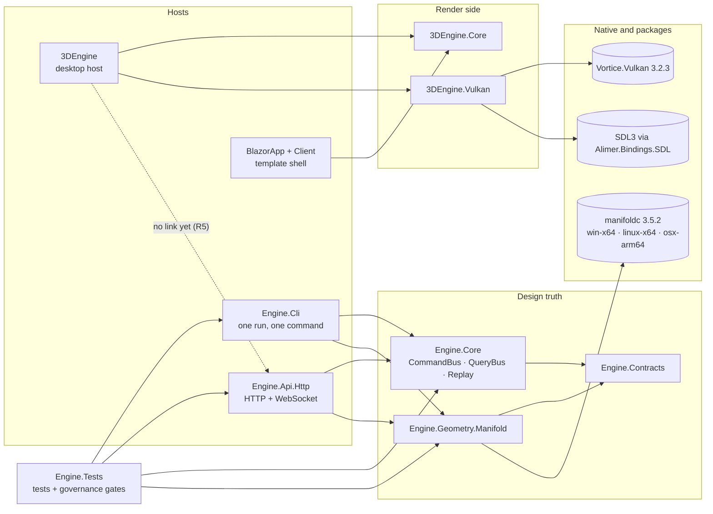
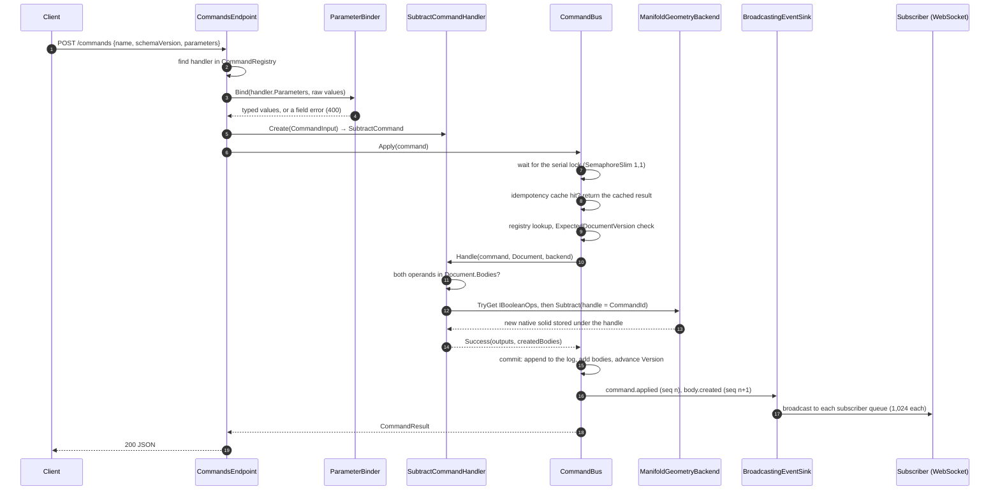
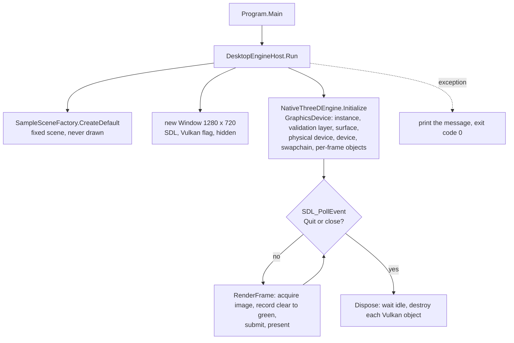
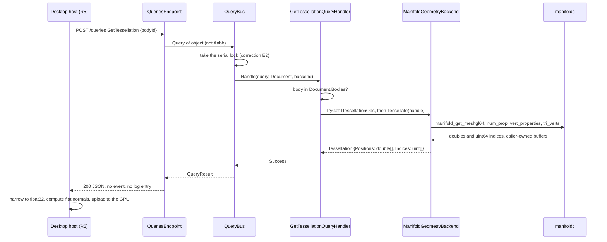

# Codebase review — 2026-09-23

This document uses Simplified Technical English (ASD-STE100). See `CLAUDE.md`, section "Language".

**Status: a dated record.** This review describes the code at one commit. `docs/CURRENT-STATE.md` is
the authority for what exists. A finding here is closed by a task, a register entry or an ADR, and
not by an edit to this file. The owner reads a rendered copy at
<https://claude.ai/artifact/6bvXVUvbVWdAcQ4Tm1mMiN> (private). This file is the record.

| Item | Value |
|---|---|
| Code state | `main` at `01a42a1` (ledger v0.28) |
| Unmerged at the time | `charter-objectives` (v0.29, documents and one test), `r2-tessellation` (a proposal only) |
| Tests | 198 on `main`, 201 on `charter-objectives` |
| Code changed by the review | none |

**Labels.** **[Observed]** means: I read it in the code, or I saw it in a run. **[Inferred]** means: a
conclusion from the code, and no run shows it. **[Recommended]** means: a proposal, and the owner
decides.

**Method.** I read the source, the tests, the configuration and the documents. I ran the
command-line host, the HTTP host with a WebSocket client, and one scratch program against
`Engine.Core`. Two review agents read the code in parallel. I checked each of their findings that
this review uses. A finding that I did not check again says "reported by a review agent".

## Summary

- **The spine works end to end.** Through HTTP, the first demonstration runs on the native backend:
  two boxes, a move, a subtract. The result has the box (−1, −1, −1) to (0, 1, 1), which is
  correct. **[Observed]**
- **A replay can rebuild a different document.** After one rejected command, a replay of the same
  log rejects a later command, and the replay has zero bodies. **[Observed]**
- **Queries run with no lock.** In the HTTP host, a query reads the Document and the native backend
  while a command writes them. The design documents say that queries run in series. **[Observed]**
  in the code.
- **The renderer is not connected yet.** The desktop host clears the screen to green. It has no
  reference to the engine, and it has three Vulkan defects for macOS, Linux and the frame loop.
  **[Observed]** in the code.
- **The R2 plan has one false premise.** Both hosts fix the result type of each query to `Aabb`. So
  R2 must change the hosts, which ADR-0018 and TASK-0028 exclude. **[Observed]**
- **Continuous integration cannot see three losses.** A loss of the native path, a difference
  between platforms, and a skipped native test all give a green run. **[Observed]**

## 1 Current architecture

### Components and responsibilities

**[Observed]** The solution `3DEngine.sln` holds eleven projects. A twelfth project, outside the
solution, packs the native library. The table gives each role, as the code shows it.

| Project | Role in the code | Entry point or main type | References |
|---|---|---|---|
| `Engine.Contracts` | Design-truth types: `Command`, `Query`, `Document`, results, events, the handler interfaces, the geometry capability interfaces, `FieldSchema`. | `Document.cs`, `Handlers/ICommandHandler.cs` | none |
| `Engine.Core` | The authority. Serial command bus, query bus, registries, the event sink, the idempotency cache, replay, the parameter binder, the handler catalog, the managed backends. | `CommandBus.cs`, `Hosting/HandlerCatalog.cs` | Contracts |
| `Engine.Geometry.Manifold` | The native geometry backend over the Manifold C API, with source-generated P/Invoke. | `ManifoldGeometryBackend.cs` | Contracts, native package 3.5.2 |
| `Engine.Cli` | The embedded host. One command or one query in each run. No state between runs. | `Program.cs` → `Cli.Run` | Contracts, Core, Manifold |
| `Engine.Api.Http` | The deployment process. `POST /commands`, `POST /queries`, `GET /schema/*`, and the WebSocket `GET /events`. | `Program.cs` (minimal API) | Contracts, Core, Manifold |
| `Engine.Tests` | Unit tests, scenario tests and the governance gates. 46 source files on `main`. | xUnit 2.9.3 | each `Engine.*` project |
| `3DEngine.Core` | The render-side scene kernel (ADR-0009). Scene types and a fixed sample scene. Most types have no caller. | `Services/SampleSceneFactory.cs` | none |
| `3DEngine.Vulkan` | The first-party Vulkan layer (ADR-0017): device, swapchain, SDL window. | `GraphicsDevice.cs` | none; Vortice.Vulkan 3.2.3, Alimer.Bindings.SDL 3.9.2 |
| `3DEngine` | The desktop host. It opens a window and clears it to green. It has no link to the engine. | `Program.cs` → `DesktopEngineHost.Run` | 3DEngine.Core, 3DEngine.Vulkan |
| `BlazorApp`, `BlazorApp.Client` | A template web shell with fixed text. It makes no call to the engine. | `BlazorApp/Program.cs` | Client → 3DEngine.Core |
| `eng/manifold-native/…Native.csproj` | The project that packs the native Manifold library into the local NuGet package. | workflow `build-manifold-native.yml` | none |



*Project references, as the project files give them. The dotted line is the connection that phase
R5 must build.* **[Observed]**

### External dependencies

- .NET SDK 10.0.300 or higher, with `rollForward: latestFeature` and no preview (`global.json`).
  **[Observed]**
- Manifold 3.5.2, a double-precision build, from the local feed `nuget/` (`nuget.config`, register
  entry R-0007). The package holds `win-x64`, `linux-x64` and `osx-arm64` only. **[Observed]**
- Vortice.Vulkan 3.2.3 and Alimer.Bindings.SDL 3.9.2, pinned only in `3DEngine.Vulkan.csproj`.
  **[Observed]**
- ASP.NET Core minimal API and `System.Net.WebSockets` for the HTTP host. **[Observed]**
- GitHub Actions: the gate runs on `ubuntu-latest`, `windows-latest` and `macos-latest` on each push.
  No runner has a graphics processor. **[Observed]**

### The main workflow: a command through HTTP

**[Observed]** I ran the HTTP host and sent the first demonstration. The output below is the real
response. Each applied command uses one sequence number, and each new body uses one more.

```
A  CreateBox 2x2x2   status=Applied seq=1 version=2
B  CreateBox 2x2x2   status=Applied seq=3 version=4
T  Translate B +1x   status=Applied seq=5 version=6
S  Subtract A - T    status=Applied seq=7 version=8
Q  GetBoundingBox S  min=(-1, -1, -1) max=(0, 1, 1) asOf=8
```



*A command through the HTTP host. Source: `CommandsEndpoint.cs`, `CommandBus.cs:40-150`,
`SubtractCommandHandler.cs:40-100`, `EngineHost.cs:53`.* **[Observed]**

### The event stream: reset and resume

**[Observed]** A client opens `GET /events` and sends one subscribe frame. With no cursor, the host
sends `subscription.reset` with a snapshot of the Document. With the correct document identifier and
a last sequence number, the host sends `subscription.resume` and then the missed events. The rule is
at `EventBroadcaster.cs:44-47`. This is the real output:

```
subscribe {}                                   → subscription.reset (version 8, 4 bodies in the snapshot)
subscribe {"documentId": …, "lastSeenSeq": 6}  → subscription.resume fromSeq 7
                                               → seq 7 command.applied Subtract
                                               → seq 8 body.created kind Solid (bodyId = causeCommandId)
```

The in-memory sink keeps the last 10,000 events (`InMemoryEventSink.cs:10`). Each subscriber has a
bounded queue of 1,024 messages and a heartbeat after 30 seconds of silence (`Subscriber.cs:21-22`).
A subscriber that falls behind is disconnected. It can subscribe again with its cursor, and it gets a
reset if the buffer no longer holds its events. **[Observed]** in the code.

### The desktop host



*The frame loop. Source: `DesktopEngineHost.cs`, `NativeThreeDEngine.cs`, `GraphicsDevice.cs`. On
this computer the validation layer is active and silent. Two injected defects proved that it
reports.* **[Observed]**

### Important runtime behaviour

- **One engine for each process, in memory only.** A restart of the HTTP host loses each body
  (`Program.cs:7`). **[Observed]**
- **The command line keeps no state.** I created a box in one run. In the next run, a query and a
  subtract for that body both gave `E-GEOM-BODY-NOT-FOUND`. **[Observed]**
- **The backend is chosen when a host starts.** Manifold is used when its library loads. If it does
  not load, the managed backend is used, and no message tells the client (`Cli.cs:192-194`,
  `EngineHost.cs:39-41`). **[Observed]**
- **Commands run one at a time. Queries do not wait.** `CommandBus` holds a `SemaphoreSlim(1,1)`
  (`CommandBus.cs:21,45`). `QueryBus` holds no lock (`QueryBus.cs:23-43`). **[Observed]**
- **`Document.Version` counts every event**, including rejected and cancelled commands
  (`Document.cs:11-14`). The log holds applied commands only (`CommandBus.cs:102`). **[Observed]**
- **A duplicate `CommandId` returns the cached result**, for the last 1,024 commands, with FIFO
  eviction (`IdempotencyCache.cs:5-15`). The cache also keeps rejected results. **[Observed]**
- **A body handle is the `CommandId`** of the command that made it (`SubtractCommandHandler.cs:73`).
  The WebSocket trace confirms it. **[Observed]**

## 2 Patterns in use

| Pattern | Where | What it does here |
|---|---|---|
| Command log with projections (event sourcing) | `Document.cs:16-23`, `CommandBus.cs:98-138` | The log is the authority. `Bodies` is a projection. Events are observations. |
| Command, query and event triad (CQRS) | `CommandBus.cs`, `QueryBus.cs:8` | Commands change state and are logged. Queries read and are not logged. |
| Serial writer with commit at the end | `CommandBus.cs:45,81-138` | The handler runs first. The Document changes only in the commit step. |
| Idempotent retry by identifier | `CommandBus.cs:48-52`, `IdempotencyCache.cs` | A retried request with the same identifier gets the first result. |
| Optimistic concurrency | `CommandBus.cs:72-79` | A command can state the version that it saw. |
| Handler declares its schema and builds its command | `ICommandHandler.cs:13,33`, `ParameterBinder.cs` (ADR-0013, ADR-0016) | No host names a command. `/schema` is a projection of the declarations. |
| One explicit registry list | `HandlerCatalog.cs:24-37` | A fixed order, no assembly scan, so replay uses a fixed set. |
| Capability negotiation | `IGeometryBackend.cs:9-13` | A handler asks `TryGet<T>()`. A missing capability gives `E-GEOM-CAP-MISSING`. |
| Deterministic identity | `SubtractCommandHandler.cs:73` | A handle comes from the `CommandId`, so a replay gives the same handles. |
| Composition root | `EngineHosting.cs`, `Cli.cs:186-202`, `EngineHost.cs:35-55` | Only a host names the native backend (ADR-0014 §4). |
| Decorator | `BroadcastingEventSink.cs`, `EngineHost.cs:53` | Broadcasting wraps the in-memory sink. `Engine.Core` knows nothing about WebSockets. |
| Snapshot plus resume from a cursor | `EventBroadcaster.cs:33-74` | A late client resumes from a sequence number, or gets a snapshot. |
| Bounded queue for each consumer | `Subscriber.cs:8-22` | A slow client cannot stop the bus (anti-objective 8). |
| Owned native handles | `ManifoldSolidHandle.cs`, `ManifoldNative.cs` | A `SafeHandle` frees each native solid one time. `[LibraryImport]` generates the P/Invoke code. |
| Governance as tests | `Engine.Tests/Governance/*` | On `main`, eleven gate classes fail the build. Seven of them read documents and project files. |

### Where the implementation differs from the intended design

Each row below was checked in the code. The right column names the document that holds the intent.

| Intent | Implementation | Source of the intent |
|---|---|---|
| A replay rebuilds an equivalent Document. | After a rejection, the replay rejects a command that the first run applied. **[Observed]** | `Replay.cs:6-7`, ADR-0015 §5, anti-objective 16 |
| V1 runs queries in series with commands. | No lock in `QueryBus`. The Manifold comment "every call runs inside CommandBus's serial commit section" is false for queries. **[Observed]** | ADR-0008 "Open challenges", `ManifoldGeometryBackend.cs:13-14` |
| A bounded inbound queue of 64, with `bus.busy`. A `Cancellable` flag on each command. The cache keeps applied results. | An unbounded wait, no flag, and every result is cached. **[Observed]** | ADR-0006 §4, §5, §7; ADR-0008 keeps them |
| "If a capability does not work here, it is not built" (the command line). | Translate, Subtract and GetBoundingBox cannot succeed on the command line, because each run starts empty. **[Observed]** | `docs/CHARTER.md`, "Target consumers" |
| A command records the backend that ran it. | `Command` has no such field. **[Observed]** | Anti-objective 10 |
| A host that draws projects engine events into render state. | The desktop host references no `Engine.*` project. It loads a fixed sample scene and draws nothing from it. **[Observed]** | ADR-0009 §4 |
| Blazor is WebAssembly only, with two pages, and it references only `Engine.Contracts`. | Server and WebAssembly modes, template pages, a reference to `3DEngine.Core`, and no call to the engine. **[Observed]** | ADR-0003 §1, §3, validation rule 1 |
| An interactive drag sends provisional commands to the log. | ADR-0007 says: no command until release. The review of 2026-09-20 also says that "a preview must not be a command". **[Observed]** in the documents. | Anti-objective 2 versus ADR-0007 |
| The surface describes itself. | `/schema/events` lists five kinds that no code emits, for example `document.saved`. **[Observed]** | Charter, "The surface describes itself" |
| The hosts are generic over query results (ADR-0018 draft). | Both hosts call `Query<Aabb>` (`Cli.cs:157`, `QueriesEndpoint.cs:81`). Each comment cites ADR-0016 "Next", and that section does not mention the limit. **[Observed]** | ADR-0018 (proposed), TASK-0028 |

## 3 Review of the code

The findings are in order of importance. **Critical** can give wrong design truth. **High** breaks an
objective on a supported platform. **Medium** is fragile or misleading. **Low** is clean-up.
"Confirmed" means that a run or the code proves the problem. "Risk" means that the mechanism exists
but no run shows the effect.

### Correctness of the engine

#### E1 · Critical · A replay can rebuild a different Document · Confirmed

- **Evidence.** A scratch program against `Engine.Core`: a rejected `CreateBox` (size −1), then a
  `CreateBox` with `ExpectedDocumentVersion = 1`. First run: `Applied, version=3, log=1, bodies=1`.
  Replay of that log: `version=1, log=0, bodies=0`. The cause is that `Version` counts rejected events
  (`Document.cs:11-14`, `CommandBus.cs:159-174`), and the log does not hold them. **[Observed]**
- **Impact.** Phase P8a saves the log and replays it. A saved document can then open with missing
  bodies. The replay gate cannot see this, because its fixture has no rejection and no expected
  version (`ReplayDeterminismFixture.cs:23-29`).
- **Correction.** **[Recommended]** Choose one meaning for the version, in an ADR: (a) the version
  counts applied commands only, and a rejection changes nothing; or (b) the log also records each
  rejection, so a replay reproduces it. I lean to (a): a rejection is not design truth. The ADRs are
  not clear, so `CLAUDE.md` "Stop and ask" applies.
- **Verify.** Add the scratch sequence to the replay gate as a fixture: a rejection, then a command
  with an expected version. The replay must give the same bodies and the same version.

#### E2 · Critical · Queries read shared state while a command writes it · Confirmed mechanism, the effect is a risk

- **Evidence.** `QueryBus` takes no lock (`QueryBus.cs:23-43`). The HTTP host serves requests in
  parallel and shares one `Document` and one backend (`EngineHost.cs:45-54`). `Document._bodies` and
  the Manifold dictionary are plain `Dictionary` objects. **[Observed]**
- **Impact.** A `Dictionary` that is read during a write can throw or give wrong data. A query can
  also call a native Manifold function on a solid while a command changes the dictionary.
  **[Inferred]**: I did not produce a failure. R2 makes the exposure larger, because a tessellation
  takes longer than a bounding box.
- **Correction.** **[Recommended]** Run each query inside the same serial lock, as ADR-0008 already
  chose for V1. Correct the comment in `ManifoldGeometryBackend.cs:13-14`.
- **Verify.** A test that sends 1,000 commands and 1,000 queries in parallel through
  `WebApplicationFactory`. It must give no error 500 and no exception.

#### E3 · High · The backend changes with no message · Confirmed

- **Evidence.** Both hosts use the managed backend when `manifoldc` does not load (`Cli.cs:192-194`,
  `EngineHost.cs:39-41`). No diagnostic, event or query names the active backend. The package has no
  `win-arm64`, `linux-arm64` or `osx-x64` library. **[Observed]**
- **Impact.** On those platforms, each Translate and each Subtract fails with `E-GEOM-CAP-MISSING`. A
  log from a native host replays differently on such a host (anti-objectives 10 and 16).
- **Correction.** **[Recommended]** Make the active backend visible: a startup line and a field in
  `/schema` or in a query. Record the backend in the log when P8a starts, as anti-objective 10
  requires.
- **Verify.** A test that hides the native library and reads the reported backend.

#### E4 · High · The commit uses a cancellable token after the log append · Confirmed mechanism, latent

- **Evidence.** `CommandBus.cs:102-115` appends to the log, then passes the request token to
  `_events.Append`. The `try` covers only the handler (`:83-90`). `Cancel()` already uses
  `CancellationToken.None` (`:204`). **[Observed]**
- **Impact.** A sink that honours the token can leave a command in the log with no event and no
  version change. Today no sink uses the token, so no run shows it (anti-objective 4).
- **Correction.** **[Recommended]** Use `CancellationToken.None` after the log append.
- **Verify.** A test with a sink that throws on cancellation, and a cancelled token during the commit.

#### E5 · Medium · An integer from HTTP JSON can never bind · Confirmed, latent

- **Evidence.** `JsonParameters.cs:44`: `element.TryGetInt64(out var whole) ? whole :
  element.GetDouble()`. The two branches have the types `long` and `double`, so C# converts the
  result to `double`. The binder accepts only `long` or `int` for an integer field. **[Observed]**
- **Impact.** No handler declares an integer field yet. The first one will fail on HTTP and pass on
  the command line.
- **Correction.** Cast one branch to `object`: `? (object)whole : element.GetDouble()`.
- **Verify.** A binder test through `JsonParameters` with the JSON value `42`.

#### E6 · Medium · Other engine findings · Confirmed

- A `datetime` parameter uses `DateTimeStyles.RoundtripKind` (`ParameterBinder.cs:105-109`). A value
  with an offset becomes local time, which depends on the computer. It is latent, because no handler
  declares a datetime. **[Observed]**
- ADR-0006 §4, §5 and §7 are not implemented: no bounded queue, no `bus.busy`, no `Cancellable` flag,
  and the cache keeps rejected results. **[Observed]**
- The hosts reject an unknown command without the bus (`Cli.cs:86-95`), so that rejection has no
  event and no sequence number. The bus gives an event for the same case (`CommandBus.cs:64-70`).
  **[Observed]**
- `/schema/events` lists `command.progress`, `document.loaded`, `document.replayed`,
  `document.saved` and `validation.report`, and no code emits them (`SchemaEventsEndpoint.cs:15-24`).
  **[Observed]**
- A query on the command line can never find a body, and a multi-step command can never succeed.
  **[Observed]** This contradicts the charter rule for `Engine.Cli`.

### The Vulkan layer and the desktop host

#### V1 · High · `VK_SUBOPTIMAL_KHR` is handled as a failure · Confirmed in the code, not run

- **Evidence.** `GraphicsDevice.cs:377-379` puts the acquire semaphore back into the pool for each
  result that is not `Success`. With `SUBOPTIMAL`, an image is acquired and the semaphore signal is
  still pending. `RenderFrame` then acquires again (`:300-303`), and the pool gives back the same
  semaphore. **[Observed]**
- **Impact.** This breaks a Vulkan valid-usage rule, and one image is never presented. It can occur
  when a window moves to another monitor, or on some compositors. **[Inferred]**
- **Correction.** Treat `SUBOPTIMAL` as a success for this frame, and create the swapchain again after
  present.
- **Verify.** With the validation layer on, force a suboptimal result. Moving the window between
  monitors of different scale is one way.

#### V2 · High · The special extent value passes the size check · Confirmed in the code, the effect on Linux is inferred

- **Evidence.** `Swapchain.cs:174`: `if (capabilities.currentExtent.width > 0)`. The value
  `0xFFFFFFFF` means "the swapchain decides the size", and it passes this check. The fallback uses
  `SDL_GetWindowSize` (`Window.cs:77`), which gives logical units, but the window asks for high pixel
  density. **[Observed]**
- **Impact.** On a surface that reports the special value, for example on Wayland, the swapchain asks
  for 4,294,967,295 pixels and fails. **[Inferred]**
- **Correction.** Compare with `uint.MaxValue`, and use `SDL_GetWindowSizeInPixels`.
- **Verify.** A unit test of `ChooseSwapExtent` with the special value. It needs no graphics
  processor.

#### V3 · High · No portability flag for macOS · Confirmed absence, the effect is inferred

- **Evidence.** The word "portability" occurs in no file of `3DEngine.Vulkan`. The instance sets no
  `VK_INSTANCE_CREATE_ENUMERATE_PORTABILITY_BIT_KHR`, and the device does not enable
  `VK_KHR_portability_subset`. **[Observed]**
- **Impact.** With a current Vulkan loader on macOS, MoltenVK is not listed, so the host cannot start
  there (objective 8). **[Inferred]**
- **Correction.** Enable portability enumeration when the loader offers the extension, and enable the
  subset extension when the device offers it.
- **Verify.** A macOS job that creates an instance and a device through MoltenVK. It needs no window.

#### V4 · Medium · Other desktop findings · Confirmed

- A failure at startup prints the message and exits with code 0 (`DesktopEngineHost.cs:48-51`,
  `Program.cs`). A script cannot see the failure. **[Observed]**
- The results of `vkCreateFramebuffer`, `vkQueueSubmit` and `vkWaitForFences` are ignored (reported
  by a review agent; the framebuffer case I saw in the port).
- The log line "Created VkInstance with version 1.3.0" prints the requested constant, not the loader
  version (reported by a review agent).
- About 40 lines fall back to validation layers that current SDKs do not ship
  (`GraphicsDevice.cs:429-467`, reported by a review agent).
- The host loads a fixed sample scene and never draws it. Most of `3DEngine.Core` has no caller, and
  `ISceneLoader` would load render state from a file, which ADR-0009 §3 does not permit (reported by
  a review agent).

### Tests and continuous integration

#### T1 · High · The pipeline cannot see three kinds of loss · Confirmed

- **Loss of the native path.** Native tests skip when the library does not load
  (`NativeManifoldFactAttribute`), and the CreateBox smoke test passes on either backend.
  **[Observed]**
- **A difference between platforms.** The replay gate runs on the managed backend, and it compares no
  geometry value. Each runner compares only with its own constants. **[Observed]**
- **A rejection in a replay.** The fixture has NoOp and CreateBox only
  (`ReplayDeterminismFixture.cs:23-29`), so defect E1 passes. **[Observed]**

**[Recommended]** Make a native test fail in the pipeline when the library does not load
(`CI=true`). Commit a baseline of exact native outputs, such as bounding-box bits and a mesh hash, and
compare it on each runner. Add a rejection and an expected version to the replay fixture.

#### T2 · Medium · Tests that cannot fail, and gates with a short list · Confirmed

- `QueryBusTests.cs:23,33` creates a sink, never gives it to the bus, and then asserts that the sink
  is empty. **[Observed]**
- The dispatch gate reads a fixed list of five files (`DispatchSurfaceGateTests.cs:16-23`). It does
  not read `3DEngine/`, `BlazorApp` or a new host file. **[Observed]**
- The diagnostics scanner reads `Engine.Contracts`, `Engine.Core` and `Engine.Cli` only
  (`DiagnosticsScanner.cs:17-22`). It skips `Engine.Api.Http` and `Engine.Geometry.Manifold`.
  **[Observed]**
- No test makes the backend throw through the command bus and then checks that the log, the bodies,
  the events and the backend are unchanged (reported by a review agent).
- No gate scans for the calls that determinism rules 1, 3 and 4 forbid. The code uses none of them
  today (reported by a review agent).

### Complexity and dead code

#### C1 · Low · Code that serves no objective · Confirmed

- **The web shell.** `BlazorApp` and `BlazorApp.Client` are a template with fixed text. They
  contradict ADR-0003 and make no call to the engine. They carry 44 Bootstrap files of 8.7 MB.
  **[Observed]** **[Recommended]** Delete them, and set ADR-0003 to `Withdrawn`. Or rebuild them as
  the two-page viewer of ADR-0003. The owner decides.
- **Empty contract markers.** `IBRepOps` and `IFeatureIdMap` have no implementation. The comments
  reserve OpenCascade and fillets, which the charter now refuses (reported by a review agent; the
  files are 7 lines each).
- **Flags that repeat `TryGet`.** No production code reads `BackendCapabilities` (reported by a review
  agent).
- **Old comments.** Several comments describe finished work as future work, or cite the removed
  persistence clamp (`Engine.Api.Http/Program.cs:7`). **[Observed]**

### Performance

#### P1 · Low now · Three costs that grow with the scene · Risk

- A new subscriber builds the full snapshot while it holds the broadcaster lock, which each commit
  needs (`EventBroadcaster.cs:33-74`). The pause grows with the body count (objective 13).
  **[Inferred]**
- A query that waits for the serial lock (correction E2) makes long queries delay commands. R2 must
  measure the tessellation time of a large body. **[Inferred]**
- JSON arrays of doubles for meshes cost about 20 bytes for each number. A body of 100,000 triangles
  gives about 6 to 8 MB. **[Inferred]** from the format, not measured.

### Process

#### G1 · Medium · The contract gate ran on no merge into `main` · Confirmed

The contract gate runs only on a pull request (`ci.yml:99`). On 2026-09-23 I merged
`p0-foundations` and `r1-vulkan-binding` into `main` locally, and the range held `d897346`, which
changes `Engine.Contracts`. That commit carries ADR-0016, so no rule was broken, but no gate checked
it. **[Observed]** **[Recommended]** Run the contract gate on a push to `main` too, against the
previous tip.

## 4 The next planned task

**[Observed]** `docs/roadmap.md` gives phase **R2**: "A tessellation capability. A mesh leaves the
geometry backend." Roadmap rule 2 says that R2 blocks each later phase of track R.
`tasks/TASK-0028-tessellation-capability.md` holds the work, on the unmerged branch
`r2-tessellation`. Its status is `Deferred`, because ADR-0018 has the status `Proposed`.

> **The schedule is not fully clear.** On 2026-09-23 the owner started a review of rules and
> conflicts, item by item. Items 2 to 6 are open: the drag rule, the ADR rule, tests on each system,
> a role for each project, and the other rule changes. R2 starts after the owner accepts ADR-0018.
> This review treats R2 as the next task, and it treats the defects E1 and E2 as work that must come
> first.

### What R2 requires

- A capability `ITessellationOps`, a value type `Tessellation` and a flag
  `BackendCapabilities.Tessellation` in `Engine.Contracts/Geometry/`. This is a change to the
  contracts, so it needs the owner's decision.
- An optional `Items` field on `FieldSchema`, as ADR-0013 §2 planned.
- The query `GetTessellation`, version 1, in `Engine.Core/Queries/`, and one line in
  `HandlerCatalog.cs`.
- The Manifold backend reads `manifold_get_meshgl64`. Each needed symbol is in each of the seven
  native libraries. A negative control proved that the search can fail. **[Observed]**
- **A correction to the plan:** both hosts must stop fixing the result to `Aabb` (`Cli.cs:157`,
  `QueriesEndpoint.cs:81`). TASK-0028 forbids `Engine.Cli/**` and `Engine.Api.Http/**`, so its write
  set must change. ADR-0018 says that "each surface is generic already", and that sentence is false.
  **[Observed]**



*The planned flow of R2, with the two corrections from this review.* **[Recommended]**

### Design decisions that R2 raises

| Decision | Draft position (ADR-0018) | Comment from this review |
|---|---|---|
| A separate interface, or a method on `IMeshOps` | Separate, as for translate and subtract | Consistent with the code. Keep it. |
| Double or float on the wire | Double, and the host narrows it | Correct for one precision. Narrowing loses precision far from the origin; see section 5. |
| JSON arrays or a binary buffer | JSON now, a later version can change it | Valid, because a query is not logged. Record a size limit or a measurement. |
| Winding and layout | Measure them with a signed-volume test. "The header does not state this plainly." | The Manifold documentation (version 3.0) states "CCW (from the outside)". Keep the test. Also test that each edge occurs two times, one time in each direction, and pair the edges by position (section 5). |
| Managed backend | Refuses, with `E-GEOM-CAP-MISSING` | Consistent with finding E3. The refusal must be visible. |
| Result type in the hosts | "No change to the hosts" | False. Both hosts must change. |
| Concurrency | Not mentioned | Add the serial lock for queries first (E2). |

## 5 Research for R2

A research agent fetched 24 of 25 sources and quoted each one. I checked four of them again myself:
the Manifold `MeshGLP` page, the DOI of Zhang and Chen, RFC 8259 section 6, and the symbols in the
shipped libraries. "No date" means that the page shows no date. This review cites nothing that no
one fetched.

### Sources

- **Manifold, `MeshGLP` struct reference.** manifoldcad.org. No date; the header says "Manifold 3.0".
  <https://manifoldcad.org/docs/html/structmanifold_1_1_mesh_g_l_p.html>. It says that the triangle
  indices are "in CCW (from the outside) order". It also says that `numProp` is at least 3, and that
  the first three properties are x, y and z. It describes optional merge vectors for vertices that
  share a position. **[Observed]** by me.
- **Manifold, `Manifold` class reference.** manifoldcad.org. No date; "Manifold 3.0".
  <https://manifoldcad.org/docs/html/classmanifold_1_1_manifold.html>. It describes an oriented
  2-manifold, `GetMeshGL64` for renderers, `Volume()`, and a tolerance that can merge coplanar
  triangles.
- **Manifold C header at tag v3.5.2.** Emmett Lalish and contributors. Release 2026-06-27.
  <https://raw.githubusercontent.com/elalish/manifold/v3.5.2/bindings/c/include/manifold/manifoldc.h>.
  It declares `manifold_get_meshgl64`, the accessors, 64-bit indices, and `manifold_volume`. Each of
  the seven shipped libraries exports these names. **[Observed]** by me.
- **glTF 2.0 Specification, version 2.0.1.** Khronos Group. 2021-10-11.
  <https://registry.khronos.org/glTF/specs/2.0/glTF-2.0.html>. Winding is counter-clockwise for a
  positive transform determinant. `POSITION` is float32 VEC3, and indices are uint8, uint16 or
  uint32. Base64 data makes a payload about 33% larger.
- **Khronos: glTF 2.0 released as ISO/IEC 12113:2022.** Khronos Group. 2022-08-04.
  <https://www.khronos.org/news/press/khronos-gltf-2.0-released-as-an-iso-iec-international-standard>.
  The ISO text has no technical change from the Khronos text. The ISO page itself refused the fetch
  (HTTP 403).
- **GLB format (binary glTF), early file.** Khronos glTF repository. Commit of 2017-06-02.
  <https://github.com/KhronosGroup/glTF/blob/988b8c220a4ac11be611d8cf429a894db224f8d5/specification/2.0/GLB_FORMAT.md>.
  It gives the reasons for a binary container: base64 costs decode time and about 33% of size.
- **RFC 8259, The JSON Data Interchange Syntax.** T. Bray, IETF. December 2017.
  <https://www.rfc-editor.org/rfc/rfc8259#section-6>. Implementations that expect binary64 precision
  interoperate well. Integers in the range from −(2^53)+1 to 2^53−1 are exact. **[Observed]** by me.
- **RFC 7493, The I-JSON Message Format.** T. Bray, IETF. March 2015.
  <https://www.rfc-editor.org/rfc/rfc7493>. It assumes binary64, and it puts a number that needs
  more precision into a string.
- **Standard numeric format strings.** Microsoft Learn. Updated 2026-03-30.
  <https://learn.microsoft.com/en-us/dotnet/standard/base-types/standard-numeric-format-strings>. On
  current .NET, the default format of a double gives the shortest string that round-trips.
- **C# conversions, and built-in numeric conversions.** Microsoft Learn. 2026-09-22 and 2026-01-14.
  <https://learn.microsoft.com/en-us/dotnet/csharp/language-reference/language-specification/conversions>
  and <https://learn.microsoft.com/en-us/dotnet/csharp/language-reference/builtin-types/numeric-conversions>.
  A double-to-float conversion rounds to the nearest float, and it gives a signed zero or a signed
  infinity at the limits.
- **Floating-point numeric types.** Microsoft Learn. 2026-01-14.
  <https://learn.microsoft.com/en-us/dotnet/csharp/language-reference/builtin-types/floating-point-numeric-types>.
  A float has about 6 to 9 significant digits, and a double has about 15 to 17.
- **IEEE 754-2019.** IEEE SA. Published 2019-07-22. <https://standards.ieee.org/ieee/754/6210/>. The
  page gives the metadata. The normative text is behind a paywall, so this review does not cite its
  rounding rules.
- **David Goldberg, "What Every Computer Scientist Should Know About Floating-Point Arithmetic".** ACM
  Computing Surveys. March 1991. <https://docs.oracle.com/cd/E19957-01/806-3568/ncg_goldberg.html>.
  IEEE requires exact rounding for the four basic operations, with round-to-nearest as the default.
- **VkFrontFace, VkIndexType and VkViewport.** Khronos. No date.
  <https://docs.vulkan.org/refpages/latest/refpages/source/VkFrontFace.html>,
  <https://docs.vulkan.org/refpages/latest/refpages/source/VkIndexType.html>,
  <https://docs.vulkan.org/refpages/latest/refpages/source/VkViewport.html>,
  <https://docs.vulkan.org/spec/latest/chapters/vertexpostproc.html>. `UINT32` indices are core since
  1.0. The viewport origin is the upper-left corner, a negative height is permitted, and the depth
  range is 0 to 1 by default.
- **Cha Zhang and Tsuhan Chen, "Efficient feature extraction for 2D/3D objects in mesh
  representation".** ICIP 2001, vol. 2, pp. 935–938. October 2001.
  <https://doi.org/10.1109/ICIP.2001.958278>. The volume of a closed mesh is the sum of the signed
  volumes of the tetrahedra that each triangle forms with the origin. The sign follows the vertex
  order. **[Observed]** by me through Crossref.
- **Deron Ohlarik, "Precisions, Precisions".** AGI, first on the Insight3D blog. 2008-09-03.
  <https://help.agi.com/AGIComponents/html/BlogPrecisionsPrecisions.htm>. Far from the origin, 32-bit
  positions jitter. "Relative to center" and "relative to eye" compute in double, then convert to
  single. This article is from AGI, not from a Cesium blog.
- **Large World Coordinates, and LWC rendering.** Epic Games, Unreal Engine 5. No date.
  <https://dev.epicgames.com/documentation/unreal-engine/large-world-coordinates-in-unreal-engine-5?lang=en-US>
  and <https://dev.epicgames.com/documentation/unreal-engine/large-world-coordinates-rendering-in-unreal-engine-5>.
  Core types are 64-bit, and rendering uses a camera-relative space in 32-bit.
- **EXT_meshopt_compression, and meshoptimizer.** Khronos glTF repository; Arseny Kapoulkine. No
  date.
  <https://github.com/KhronosGroup/glTF/blob/main/extensions/2.0/Vendor/EXT_meshopt_compression/README.md>,
  <https://meshoptimizer.org/>. A ratified extension for fast decode of vertex and index data.
  Quantization is optional and loses precision.
- **Draco, and KHR_draco_mesh_compression.** Google; Khronos. No date on the pages.
  <https://google.github.io/draco/>,
  <https://github.com/KhronosGroup/glTF/blob/main/extensions/2.0/Khronos/KHR_draco_mesh_compression/README.md>.
  A mesh compression library, and the glTF extension that carries it.
- **Martin Fowler, "Event Sourcing" and "CQRS".** martinfowler.com. 2005-12-12 and 2011-07-14.
  <https://martinfowler.com/eaaDev/EventSourcing.html>, <https://martinfowler.com/bliki/CQRS.html>. A
  log of changes rebuilds the state. A read model can differ from the write model, and it can come
  from the events.

### What applies to this codebase

The research supports:

- **CCW winding from the outside.** Manifold documents it, and glTF uses the same rule. ADR-0018 says
  that the header "does not state this plainly". That is true of the header, but the documentation
  states it. Keep the signed-volume test, because the documentation shows version 3.0, not 3.5.2.
- **Doubles in JSON.** RFC 8259 and RFC 7493 give binary64 as the interoperable form. The indices
  are far inside the exact integer range.
- **One defined narrowing.** C# rounds each double to the nearest float, so the host gives one result
  for each value.
- **A query that is not logged.** The Fowler articles match ADR-0018 decision 4. A read model can
  change its wire form without a migration.
- **Two independent volume values.** The sum of signed tetrahedra (Zhang and Chen) and
  `manifold_volume` must agree. Each shipped library exports `manifold_volume`.
- **`UINT32` indices** go into a Vulkan index buffer directly.

The research warns against:

- **Narrowing large coordinates.** A float has a 24-bit significand. At 10,000 units from the origin,
  two floats are about 0.001 units apart: 1 mm if the unit is the metre. The Document has no unit yet
  (phase P8e). Objective 13 (very large scenes) makes this real. The host must subtract a
  double-precision origin, such as the camera position or the body centre, before it narrows (AGI
  2008, Unreal LWC).
- **Pairing edges by index only.** `MeshGL` can split vertices that share a position. A closed-mesh
  test must pair edges by position, or it must apply the merge vectors first.
- **Assuming a stride of 3.** Read `numProp` and take the first three values of each stride.
- **Base64 in JSON** for a later binary form: glTF gives about 33% more size. Use a binary body, such
  as GLB or a raw buffer, when the size matters.
- **A Y-axis mistake in the host.** The Vulkan viewport origin is the upper-left corner. The host
  must choose `frontFace` together with its viewport flip, or back faces become front faces.

### Limits of the evidence

- The Manifold documentation shows version 3.0. The v3.5.2 header matches its names, but no source
  states the winding for 3.5.2 itself.
- The normative text of IEEE 754-2019 is behind a paywall. The C# specification is the source for the
  narrowing.
- No source says whether `manifold_get_meshgl64` emits merge vectors for a mesh with three
  properties. The task must measure it with `manifold_meshgl64_merge_length`, which each library
  exports.
- No source measures the time or the JSON size of a tessellation in this engine. The task must
  measure both.

### Also relevant: the drag rule (item 2 of the owner's review)

The two systems below separate state that is saved from state that is only shown. **[Observed]** by
me.

- **Yjs, "Adding awareness".** No date. <https://docs.yjs.dev/getting-started/adding-awareness>.
  Awareness data, such as cursors and presence, "isn't stored in the Yjs document, as it doesn't need
  to be persisted across sessions".
- **Figma, "How Figma's multiplayer technology works".** No date on the fetched text.
  <https://www.figma.com/blog/how-figmas-multiplayer-technology-works/>. The server is the authority.
  The undo history stays in the client.

**[Recommended]** Keep ADR-0007: during a drag, the preview stays in the client, and one command goes
to the log on release. Anti-objective 2 wanted to stop temporary state from entering a save. Its own
second rule already does that: save writes the log, not the memory. If other clients must see a drag
later, add a separate channel that is never stored, like the Yjs awareness data. Do not use the log
for it.

## 6 Recommended approach

**[Recommended]** Each step is one task and one commit topic, and each ends green in the pipeline.
Steps 1 to 3 correct the architecture before R2 adds to it.

1. **Decide the meaning of the version (E1).** One ADR: the version counts applied commands, or the
   log records rejections. Add the failing sequence from this review to the replay gate first, and
   watch it fail. Then correct the code, and watch it pass.
2. **Put queries in series (E2).** Queries take the same lock as commands. Add the parallel stress
   test. Correct the comment in `ManifoldGeometryBackend.cs:13-14`.
3. **Make the pipeline see losses (T1).** In the pipeline, a native test fails and does not skip. Add
   a smoke test for Translate and Subtract. Then check once that the three runners really run the
   native tests.
4. **Correct ADR-0018 and TASK-0028, then decide.** Add the two host files to the write set, and
   remove the false sentence. Then the owner accepts or refuses the ADR.
5. **The contracts.** `ITessellationOps`, `Tessellation`, the flag and `FieldSchema.Items`, in one
   commit with the ADR status change.
6. **The backend.** First prove the ownership rule of `manifold_delete_meshgl64` with a test that
   would crash on a double free. Then read `numProp` and take the first three values of each stride.
   Measure `manifold_meshgl64_merge_length` for a box. Throw when an index does not fit in 32 bits.
7. **The query and the hosts.** The handler, the catalog line, and `Query<object>` in both hosts.
8. **The evidence.** Signed volume +24 for a 2 × 3 × 4 box, and equal to `manifold_volume`. +4 for
   the cut of the first demonstration. Each edge two times, in opposite directions, paired by
   position. Each position inside the bounding box. No event and no version change. `items` in
   `/schema`. Record the time and the JSON size for a body of about 100,000 triangles.
9. **Look at it.** Run the HTTP host and request the tessellation of the cut body. Keep the output in
   the task file as the observable result of R2.
10. **Write down the rule for the host, for R5.** The host subtracts a double-precision origin before
    it narrows to float, and it chooses `frontFace` together with its viewport flip. Put both rules
    into the R5 task now, because the research gives them.

Two fixes are small and independent, and each can come with any step: the integer binding (E5) and
the Vulkan extent check (V2). V1 and V3 belong to the first render phase that runs on macOS or Linux.

## Questions for the owner

The repository cannot answer these. Each one changes the work.

1. **The version (E1).** Must a rejected command change the document version? I recommend no.
2. **ADR-0018.** Do you accept it after the two corrections in step 4?
3. **The web shell.** Delete `BlazorApp`, or rebuild it as the viewer of ADR-0003?
4. **The drag (anti-objective 2 versus ADR-0007).** Keep the preview in the client and send one
   command on release? Section 5 gives the evidence, and I recommend yes.
